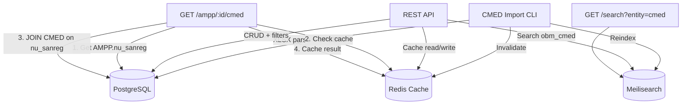

# CMED Conformidade — Design

**Spec**: `.specs/features/cmed-conformidade/spec.md`
**Status**: Draft

---

## Architecture Overview

Feature standalone que se integra ao sistema OBM existente via campo `nu_sanreg` (Registro Sanitário). A tabela CMED é independente — não altera tabelas OBM. JOINs são feitos sob demanda com cache Redis.



---

## Code Reuse Analysis

### Existing Components to Leverage

| Component | Location | How to Use |
|---|---|---|
| `GenericRepo` pattern | `internal/infrastructure/persistence/postgres/generic_repo.go` | Replicar padrão para CMEDRepo (GetByID, List com ILIKE, scan) |
| `SyncRepo` | `internal/infrastructure/persistence/postgres/sync_repo.go` | Adicionar `GetAllCMED()` seguindo padrão de `GetAllAMPs` |
| `MeilisearchRepo.batchIndex` | `internal/infrastructure/persistence/meilisearch/indexer.go` | Reutilizar `batchIndex` para `IndexCMEDs` |
| `MeilisearchRepo.Search` | `internal/infrastructure/persistence/meilisearch/client.go` | Estender para mapear hits `cmed` → SearchHit |
| `ReindexUsecase` | `internal/usecase/reindex.go` | Adicionar step `GetAllCMED` + `IndexCMEDs` |
| `SearchUsecase` | `internal/usecase/search.go` | Estender default entities para incluir `cmed` |
| `CursorPage[T]` | `internal/domain/entity/entities.go` | Reutilizar para paginação CMED |
| `FilterParams` | `internal/domain/repository/interfaces.go` | Estender com campos CMED (Tarja, Registro, EAN, Referencia) |
| `dto.SearchRequest` | `internal/interface/http/dto/dto.go` | Estender com `filter[tarja]`, `filter[registro]` |
| `GenericHandler` | `internal/interface/http/handler/generic_handler.go` | Referência de padrão, mas CMED handler será dedicado |
| Import CLI pipeline | `cmd/import/main.go` | Referência de padrão flags, logging |
| Docker Compose | `docker-compose.yml` | Adicionar serviço Redis |
| Config loading | `internal/infrastructure/config/config.go` | Adicionar `RedisConfig` |

### Integration Points

| System | Integration Method |
|---|---|
| OBM AMPP | `tb_ampp.nu_sanreg` = `tb_cmed_conformidade.nu_sanreg` (JOIN lógico, sem FK) |
| Meilisearch | Novo index `obm_cmed`, adicionar entity `cmed` na busca global |
| Redis | Cache de JOIN AMPP+CMED, lookup reverso EAN→nu_sanreg |
| Docker Compose | Serviço `redis:7-alpine` |

---

## Components

### 1. CMEDConformidade Entity

- **Purpose**: Representar um registro da planilha CMED de conformidade de preços
- **Location**: `internal/domain/entity/cmed.go`
- **Interfaces**: Struct Go com tags `json` e `db`
- **Dependencies**: Nenhuma
- **Reuses**: Padrão de `entity.AMP` / `entity.VMP`

```go
type CMEDConformidade struct {
    COSeqID             int64           `json:"co_seq_id" db:"co_seq_id"`
    NUSanReg            *int64          `json:"nu_sanreg" db:"nu_sanreg"`
    NUGgrem             *string         `json:"nu_ggrem" db:"nu_ggrem"`
    DSSubstancia        *string         `json:"ds_substancia" db:"ds_substancia"`
    NUCnpj              *string         `json:"nu_cnpj" db:"nu_cnpj"`
    NOLaboratorio       *string         `json:"no_laboratorio" db:"no_laboratorio"`
    NOProduto           *string         `json:"no_produto" db:"no_produto"`
    DSApresentacao      *string         `json:"ds_apresentacao" db:"ds_apresentacao"`
    DSClasseTerapeutica *string         `json:"ds_classe_terapeutica" db:"ds_classe_terapeutica"`
    TPProduto           *string         `json:"tp_produto" db:"tp_produto"`
    TPRegimePreco       *string         `json:"tp_regime_preco" db:"tp_regime_preco"`
    NUEAN1              *string         `json:"nu_ean1" db:"nu_ean1"`
    NUEAN2              *string         `json:"nu_ean2" db:"nu_ean2"`
    NUEAN3              *string         `json:"nu_ean3" db:"nu_ean3"`
    // Preços principais (colunas fixas)
    VRPFSemImpostos     *float64        `json:"vr_pf_sem_impostos" db:"vr_pf_sem_impostos"`
    VRPF0               *float64        `json:"vr_pf_0" db:"vr_pf_0"`
    VRPF12              *float64        `json:"vr_pf_12" db:"vr_pf_12"`
    VRPF17              *float64        `json:"vr_pf_17" db:"vr_pf_17"`
    VRPF18              *float64        `json:"vr_pf_18" db:"vr_pf_18"`
    VRPF20              *float64        `json:"vr_pf_20" db:"vr_pf_20"`
    VRPMCSemImpostos    *float64        `json:"vr_pmc_sem_impostos" db:"vr_pmc_sem_impostos"`
    VRPMC0              *float64        `json:"vr_pmc_0" db:"vr_pmc_0"`
    VRPMC12             *float64        `json:"vr_pmc_12" db:"vr_pmc_12"`
    VRPMC17             *float64        `json:"vr_pmc_17" db:"vr_pmc_17"`
    VRPMC18             *float64        `json:"vr_pmc_18" db:"vr_pmc_18"`
    VRPMC20             *float64        `json:"vr_pmc_20" db:"vr_pmc_20"`
    // JSONB com todas alíquotas detalhadas
    JSPrecosPF          *string         `json:"js_precos_pf" db:"js_precos_pf"`
    JSPrecosPMC         *string         `json:"js_precos_pmc" db:"js_precos_pmc"`
    // Outros campos
    STRestricaoHospitalar *string       `json:"st_restricao_hospitalar" db:"st_restricao_hospitalar"`
    STCap                *string        `json:"st_cap" db:"st_cap"`
    STConfaz87           *string        `json:"st_confaz_87" db:"st_confaz_87"`
    STIcms0              *string        `json:"st_icms_0" db:"st_icms_0"`
    DSAnaliseRecural     *string        `json:"ds_analise_recural" db:"ds_analise_recural"`
    DSListaPisCofins     *string        `json:"ds_lista_pis_cofins" db:"ds_lista_pis_cofins"`
    STComercializacao    *string        `json:"st_comercializacao" db:"st_comercializacao"`
    DSTarja              *string        `json:"ds_tarja" db:"ds_tarja"`
    DSDestinacaoComercial *string       `json:"ds_destinacao_comercial" db:"ds_destinacao_comercial"`
    DTReferencia         string         `json:"dt_referencia" db:"dt_referencia"`
    STRegistroAtivo      string         `json:"st_registro_ativo" db:"st_registro_ativo"`
}
```

### 2. CMEDRepository Interface

- **Purpose**: Contrato para persistência de dados CMED
- **Location**: `internal/domain/repository/interfaces.go` (adicionar)
- **Interfaces**:
  - `GetByID(ctx, id) (*CMEDConformidade, error)`
  - `GetByNuSanReg(ctx, nuSanReg int64, dtReferencia string) (*CMEDConformidade, error)`
  - `GetByEAN(ctx, ean string, dtReferencia string) (*CMEDConformidade, error)`
  - `List(ctx, CMEDFilterParams) (*CursorPage[CMEDConformidade], error)`
  - `GetHistorico(ctx, nuSanReg int64) ([]CMEDConformidade, error)`
  - `UpsertBatch(ctx, records []CMEDConformidade) (int64, error)`
- **Dependencies**: `entity.CMEDConformidade`, `entity.CursorPage`

### 3. CMEDFilterParams

- **Purpose**: Parâmetros de filtro específicos do CMED
- **Location**: `internal/domain/repository/interfaces.go` (adicionar)
- **Reuses**: Extende padrão de `FilterParams` existente

```go
type CMEDFilterParams struct {
    Nome         string
    Registro     string
    EAN          string
    Tarja        string
    TipoProduto  string
    RegimePreco  string
    DTReferencia string
    Ativo        *bool
    Limit        int
    Cursor       string
}
```

### 4. Postgres CMEDRepo

- **Purpose**: Implementação PostgreSQL do CMEDRepository
- **Location**: `internal/infrastructure/persistence/postgres/cmed_repo.go`
- **Interfaces**: Implementa `repository.CMEDRepository`
- **Dependencies**: `pgxpool.Pool`
- **Reuses**: Padrão de `generic_repo.go` (scan, ILIKE, cursor pagination)

### 5. Redis Cache Client

- **Purpose**: Cliente Redis para cache de JOINs AMPP+CMED
- **Location**: `internal/infrastructure/persistence/redis/client.go`
- **Interfaces**:
  - `Get(ctx, key) (string, error)`
  - `Set(ctx, key, value, ttl) error`
  - `DeleteByPattern(ctx, pattern) error`
  - `HealthCheck(ctx) error`
- **Dependencies**: `github.com/redis/go-redis/v9`
- **Reuses**: Nenhum (componente novo)

### 6. SyncRepo Extension

- **Purpose**: Adicionar `GetAllCMED()` ao SyncRepo existente
- **Location**: `internal/infrastructure/persistence/postgres/sync_repo.go` (modificar)
- **Interfaces**: `GetAllCMED(ctx) ([]map[string]interface{}, error)`
- **Reuses**: Padrão de `GetAllAMPs`

### 7. Meilisearch Indexer Extension

- **Purpose**: Configurar index `obm_cmed` e adicionar `IndexCMEDs`
- **Location**: `internal/infrastructure/persistence/meilisearch/indexer.go` (modificar)
- **Interfaces**: `IndexCMEDs(ctx, docs) error`
- **Reuses**: `batchIndex` existente

Index settings:
```
Searchable: [no_produto, ds_substancia, no_laboratorio, nu_sanreg, nu_ean1, ds_classe_terapeutica, ds_apresentacao]
Filterable: [nu_sanreg, nu_ean1, nu_ean2, nu_ean3, tp_produto, tp_regime_preco, st_restricao_hospitalar, ds_tarja, dt_referencia, st_registro_ativo, nu_cnpj]
Sortable: [no_produto, vr_pf_sem_impostos, vr_pmc_sem_impostos, dt_referencia]
```

### 8. Meilisearch Client Extension

- **Purpose**: Mapear hits `cmed` no Search
- **Location**: `internal/infrastructure/persistence/meilisearch/client.go` (modificar)
- **Reuses**: Padrão de mapeamento de hits existente (jsonStr, jsonInt)

Mapeamento para SearchHit:
- `co_seq_id` → ID
- `no_produto` → Nome
- `nu_sanreg` → Codigo
- `no_laboratorio` → Fabricante
- `ds_apresentacao` → Descricao

### 9. CMED Usecase

- **Purpose**: Lógica de negócio para CMED
- **Location**: `internal/usecase/cmed.go`
- **Interfaces**:
  - `List(ctx, CMEDFilterParams) (*CursorPage[CMEDConformidade], error)`
  - `GetByID(ctx, id) (*CMEDConformidade, error)`
  - `GetByRegistro(ctx, nuSanReg int64, dtReferencia string) (*CMEDConformidade, error)`
  - `GetByEAN(ctx, ean string, dtReferencia string) (*CMEDConformidade, error)`
  - `GetHistorico(ctx, id) ([]CMEDConformidade, error)`
- **Dependencies**: `repository.CMEDRepository`
- **Reuses**: Padrão de `VMPUsecase`

### 10. AMPP-CMED Usecase (JOIN com cache)

- **Purpose**: Combinar dados AMPP + CMED com cache Redis
- **Location**: `internal/usecase/ampp_cmed.go`
- **Interfaces**:
  - `GetAMPPWithCMED(ctx, amppID int64, dtReferencia string) (*AMPPCMEDResponse, error)`
- **Dependencies**: `repository.AMPPRepository`, `repository.CMEDRepository`, Redis cache
- **Reuses**: Nenhum (componente novo, mas segue padrão de usecase)

Cache strategy:
- Key: `ampp_cmed:{co_seq_id}:{dt_referencia}`
- TTL: 24h (configurável via `REDIS_CACHE_TTL`)
- Lookup reverse: `cmed:ean:{ean}` → nu_sanreg
- Invalidação: `DeleteByPattern("cmed:*")` + `DeleteByPattern("ampp_cmed:*")` no import

### 11. CMED Handler

- **Purpose**: HTTP handlers para endpoints CMED
- **Location**: `internal/interface/http/handler/cmed_handler.go`
- **Interfaces**:
  - `List(c *gin.Context)`
  - `GetByID(c *gin.Context)`
  - `GetByRegistro(c *gin.Context)`
  - `GetByEAN(c *gin.Context)`
  - `GetHistorico(c *gin.Context)`
  - `GetAMPPWithCMED(c *gin.Context)`
- **Dependencies**: CMEDUsecase, AMPPCMEDUsecase
- **Reuses**: Padrão de `VMPHandler`

### 12. CMED Import CLI

- **Purpose**: Importar planilha XLSX CMED para PostgreSQL + Meilisearch
- **Location**: `cmd/cmed_import/main.go`
- **Interfaces**: CLI flags
  - `--source` (required): caminho do arquivo XLSX
  - `--date` (required): data de referência (YYYY-MM-DD)
  - `--header-row` (optional, default 42): linha do header na planilha
  - `--skip-index` (optional, default false): pular reindexação Meilisearch
- **Dependencies**: `excelize/v2`, postgres pool, Redis client, Meilisearch repo
- **Reuses**: Padrão de `cmd/import/main.go` (flags, logging, pool creation)

Pipeline:
1. Abrir XLSX com excelize
2. Ler header row (`--header-row`), mapear colunas por nome
3. Validar colunas obrigatórias: REGISTRO, PRODUTO, SUBSTÂNCIA
4. Ler dados a partir de header-row + 1
5. Parse e limpeza: `"-"` → nil, vírgulas decimais → ponto, strings numéricas → int64/float64
6. Construir JSONB de preços completos (js_precos_pf, js_precos_pmc)
7. UPSERT batch (500 registros/batch)
8. Invalidar cache Redis: `cmed:*` e `ampp_cmed:*`
9. Reindex Meilisearch `obm_cmed` (se não --skip-index)

### 13. ReindexUsecase Extension

- **Purpose**: Adicionar CMED ao reindex
- **Location**: `internal/usecase/reindex.go` (modificar)
- **Reuses**: Padrão existente

---

## Data Models

### tb_cmed_conformidade

```sql
CREATE TABLE IF NOT EXISTS tb_cmed_conformidade (
    co_seq_id              BIGSERIAL PRIMARY KEY,
    nu_sanreg              BIGINT,
    nu_ggrem               VARCHAR(18),
    ds_substancia          TEXT,
    nu_cnpj                VARCHAR(18),
    no_laboratorio         VARCHAR(255),
    no_produto             VARCHAR(500),
    ds_apresentacao        VARCHAR(774),
    ds_classe_terapeutica  VARCHAR(255),
    tp_produto             VARCHAR(50),
    tp_regime_preco        VARCHAR(50),
    nu_ean1                VARCHAR(50),
    nu_ean2                VARCHAR(50),
    nu_ean3                VARCHAR(50),
    vr_pf_sem_impostos     NUMERIC(15,2),
    vr_pf_0                NUMERIC(15,2),
    vr_pf_12               NUMERIC(15,2),
    vr_pf_17               NUMERIC(15,2),
    vr_pf_18               NUMERIC(15,2),
    vr_pf_20               NUMERIC(15,2),
    vr_pmc_sem_impostos    NUMERIC(15,2),
    vr_pmc_0               NUMERIC(15,2),
    vr_pmc_12              NUMERIC(15,2),
    vr_pmc_17              NUMERIC(15,2),
    vr_pmc_18              NUMERIC(15,2),
    vr_pmc_20              NUMERIC(15,2),
    js_precos_pf           JSONB,
    js_precos_pmc          JSONB,
    st_restricao_hospitalar VARCHAR(5),
    st_cap                  VARCHAR(5),
    st_confaz_87            VARCHAR(5),
    st_icms_0               VARCHAR(5),
    ds_analise_recural      VARCHAR(50),
    ds_lista_pis_cofins     VARCHAR(50),
    st_comercializacao      VARCHAR(50),
    ds_tarja                VARCHAR(50),
    ds_destinacao_comercial VARCHAR(50),
    dt_referencia           DATE NOT NULL,
    st_registro_ativo       VARCHAR(20) DEFAULT 'ACTIVE',
    UNIQUE (nu_sanreg, dt_referencia)
);

CREATE INDEX idx_cmed_ean1 ON tb_cmed_conformidade (nu_ean1) WHERE nu_ean1 IS NOT NULL;
CREATE INDEX idx_cmed_referencia ON tb_cmed_conformidade (dt_referencia);
CREATE INDEX idx_cmed_sanreg_ativo ON tb_cmed_conformidade (nu_sanreg, st_registro_ativo) WHERE nu_sanreg IS NOT NULL;
CREATE INDEX idx_cmed_produto ON tb_cmed_conformidade USING gin (to_tsvector('simple', coalesce(no_produto,'')));
```

**Relationships**: `tb_cmed_conformidade.nu_sanreg` = `tb_ampp.nu_sanreg` (JOIN lógico, sem FK constraint — dados independentes)

### AMPPCMEDResponse (DTO)

```go
type AMPPCMEDResponse struct {
    AMPP  entity.AMPP          `json:"ampp"`
    AMP   *entity.AMP          `json:"amp,omitempty"`
    VMP   *entity.VMP          `json:"vmp,omitempty"`
    CMED  *entity.CMEDConformidade `json:"cmed,omitempty"`
}
```

---

## Error Handling Strategy

| Error Scenario | Handling | User Impact |
|---|---|---|
| XLSX header row não encontrada | Erro com mensagem "header row N não encontrada ou sem colunas" | 400 no CLI |
| Colunas obrigatórias faltando | Erro listando colunas faltantes | 400 no CLI |
| REGISTRO vazio ou "-" na planilha | nu_sanreg = NULL no banco | Registro importado sem vínculo AMPP |
| EAN como "-" | nu_ean1/2/3 = NULL no banco | Registro importado sem EAN |
| Valor de preço vazio | NULL no banco (NUMERIC nullable) | Campo ausente na resposta |
| Redis indisponível | Log warning + query direta PostgreSQL | Mais lento, mas funcional |
| Registro CMED não encontrado | 404 | Mensagem de not found |
| AMPP sem nu_sanreg | cmed=null na resposta JOIN | Dados parciais |

---

## Tech Decisions

| Decision | Choice | Rationale |
|---|---|---|
| Sem FK constraint CMED→AMPP | Dados independentes, CMED pode ter registros sem AMPP correspondente | Separação de responsabilidades |
| JSONB para preços detalhados | Evita 52 colunas de preço; principais em colunas fixas | Performance nas queries comuns, flexibilidade no detalhe |
| Redis para cache, não sync.Map | Compartilhado entre instâncias, TTL nativo, invalidação por padrão | Produção-ready |
| excelize/v2 para XLSX | Biblioteca Go mais madura para XLSX | Sem dependência Python |
| Cache TTL 24h | Frequência de atualização CMED é mensal | Balance entre freshness e performance |
| `--header-row` default 42 | Formato atual da planilha CMED governo | Flexível para mudanças |
| UPSERT batch 500 | Balance entre memória e performance para ~25K registros | ~50 batches, < 2 min |
| Graceful degradation sem Redis | App funciona sem Redis (apenas sem cache) | Resiliência |
