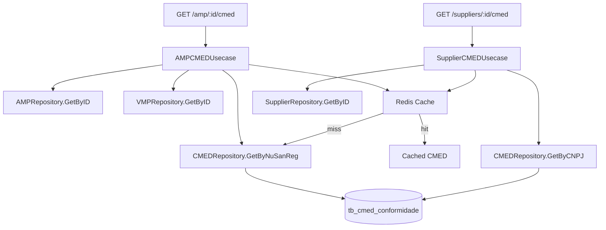

# CMED Extended Joins Design

**Spec**: `.specs/features/cmed-extended-joins/spec.md`
**Status**: Approved

---

## Architecture Overview

Segue o mesmo padrão do `AMPPCMEDUsecase` — busca entidade principal, traverse FKs para entidades pai, lookup CMED via chave exata, cache Redis com graceful degradation. Nenhuma mudança arquitetural, apenas extensão lateral.



---

## Code Reuse Analysis

### Existing Components to Leverage

| Component | Location | How to Use |
| --- | --- | --- |
| `AMPPCMEDUsecase` | `internal/usecase/ampp_cmed.go` | Mesmo padrão: fetch → traverse → CMED lookup → cache |
| `CMEDRepository.GetByNuSanReg` | `internal/infrastructure/persistence/postgres/cmed_repo.go` | Reutilizado diretamente no AMPCMEDUsecase |
| `CacheRepo` | `internal/infrastructure/persistence/redis/client.go` | Reutilizado para cache de ambos endpoints |
| `scanCMED` / `scanCMEDRows` | `internal/infrastructure/persistence/postgres/cmed_repo.go` | Reutilizado no novo `GetByCNPJ` |
| `CMEDHandler` | `internal/interface/http/handler/cmed_handler.go` | Estendido com novos métodos |
| `normalizeCNPJ` | Novo helper | Normalização de CNPJ (strip não-dígitos) |

### Integration Points

| System | Integration Method |
| --- | --- |
| AMP → CMED | `AMP.nu_nreg = CMED.nu_sanreg` (BIGINT = BIGINT) |
| Supplier → CMED | `REGEXP_REPLACE(Supplier.nu_cnpj, '[^0-9]', '', 'g') = REGEXP_REPLACE(CMED.nu_cnpj, '[^0-9]', '', 'g')` |

---

## Components

### CMEDRepository (extended)

- **Purpose**: Adicionar `GetByCNPJ` para busca por CNPJ normalizado
- **Location**: `internal/domain/repository/interfaces.go` + `internal/infrastructure/persistence/postgres/cmed_repo.go`
- **Interfaces**:
  - `GetByCNPJ(ctx, cnpj string, dtReferencia string) ([]entity.CMEDConformidade, error)` — retorna lista (1 CNPJ → N produtos)
- **Dependencies**: pgxpool
- **Reuses**: `scanCMEDRows`, `cmedColumns`

### AMPCMEDUsecase (new)

- **Purpose**: Buscar AMP com VMP pai e preço CMED via `nu_nreg`
- **Location**: `internal/usecase/amp_cmed.go`
- **Interfaces**:
  - `GetAMPWithCMED(ctx, ampID int64, dtReferencia string) (*AMPCMEDResponse, error)`
- **Dependencies**: `AMPRepository`, `VMPRepository`, `CMEDRepository`, `*CacheRepo`
- **Reuses**: mesmo padrão de `AMPPCMEDUsecase` — cache key `amp_cmed:{ampID}:{dtReferencia}`

### SupplierCMEDUsecase (new)

- **Purpose**: Buscar Supplier com lista de produtos CMED via `nu_cnpj`
- **Location**: `internal/usecase/supplier_cmed.go`
- **Interfaces**:
  - `GetSupplierWithCMED(ctx, supplierID int64, dtReferencia string) (*SupplierCMEDResponse, error)`
- **Dependencies**: `SupplierRepository`, `CMEDRepository`, `*CacheRepo`
- **Reuses**: padrão AMPPCMED — cache key `supplier_cmed:{supplierID}:{dtReferencia}`. Normaliza CNPJ antes do lookup.

### CMEDHandler (extended)

- **Purpose**: Adicionar handlers para os 2 novos endpoints
- **Location**: `internal/interface/http/handler/cmed_handler.go`
- **Interfaces**:
  - `GetAMPWithCMED(c *gin.Context)` — parse `:id` + `dt_referencia` query
  - `GetSupplierWithCMED(c *gin.Context)` — parse `:id` + `dt_referencia` query
- **Dependencies**: `AMPCMEDUsecase`, `SupplierCMEDUsecase`
- **Reuses**: mesmo padrão de `GetAMPPWithCMED`

---

## Data Models

### AMPCMEDResponse

```go
type AMPCMEDResponse struct {
    AMP  *entity.AMP               `json:"amp"`
    VMP  *entity.VMP               `json:"vmp"`
    CMED *entity.CMEDConformidade  `json:"cmed"`
}
```

### SupplierCMEDResponse

```go
type SupplierCMEDResponse struct {
    Supplier *entity.Supplier            `json:"supplier"`
    CMED     []entity.CMEDConformidade   `json:"cmed"`
}
```

---

## Error Handling Strategy

| Error Scenario | Handling | User Impact |
| --- | --- | --- |
| AMP/Supplier não encontrado | Retornar 404 | "AMP not found" / "Supplier not found" |
| `nu_nreg` / `nu_cnpj` vazio | Retornar entidade com CMED null/[] | Dados parciais sem erro |
| CMED lookup falha (PG/Redis) | Log warning, retornar CMED null/[] | Graceful degradation |
| CNPJ com formatação diferente | Normalizar removendo não-dígitos | JOIN funciona independente de formato |
| Redis indisponível | Skip cache, query direta PG | Sem cache, sem erro |

---

## Tech Decisions

| Decision | Choice | Rationale |
| --- | --- | --- |
| Normalização CNPJ no Go | Strip não-dígitos antes da query | Mais simples, testável, não depende de função SQL |
| `GetByCNPJ` retorna `[]CMEDConformidade` | Slice, não registro único | 1 CNPJ → N produtos (diferente de nu_sanreg que é 1:1 por data) |
| Cache key pattern | `amp_cmed:{id}:{dt}` / `supplier_cmed:{id}:{dt}` | Mesmo padrão do `ampp_cmed`, consistente |
| Versão | v1.4.0 (Minor) | Novos endpoints retrocompatíveis |
| `normalizeCNPJ` como helper | Função exportada no package `usecase` | Reutilizável por outros usecases se necessário |
